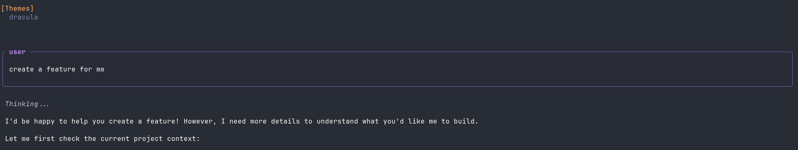

# pi-highlight-user-message

Extension to show a border around user messages in the Pi coding agent TUI.

## Features

- Adds a visual border to user messages, making them easier to distinguish from agent responses.

## Installation

To use this extension, add it to your `.pi/extensions` directory:

```bash
ln -s /path/to/pi-highlight-user-message ~/.pi/extensions/pi-highlight-user-message
```

## Screenshots



## Credits

This extension is a copy/adaptation of [pi-tool-display](https://github.com/MasuRii/pi-tool-display).
